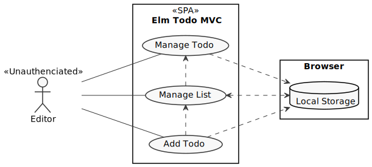
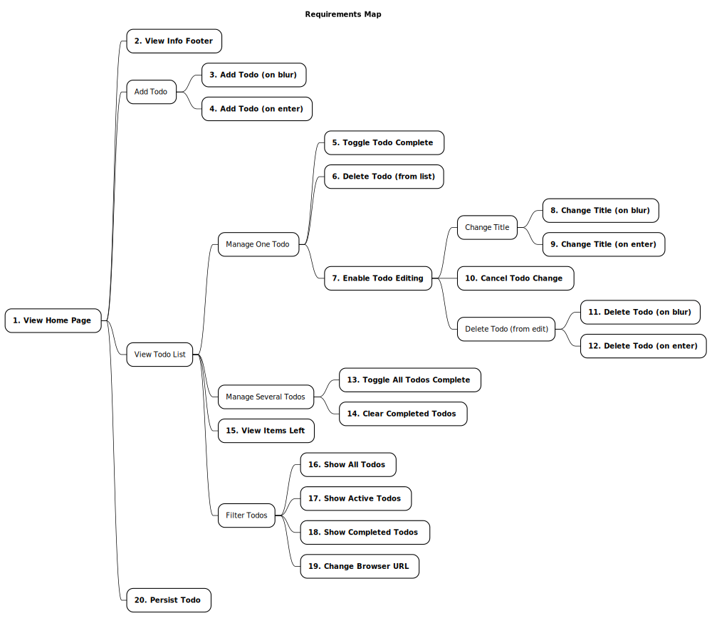

# Elm Todo MVC

## Solution Context

Elm Todo MVC is a stand-alone application that enable an unauthenticated user to manage todo items in their Browser.

## Requirements

The diagram below shows how the goals relate to one another. Dependencies flow from left to right. Goals on the left are supported by the goals they link to on the right. Numbered goals have rules that must be implemented. The goal numbers map to the specification files.

## Progress

| Goal | Status |
| ---- | ---- |
| 01-add-new-todo-on-blur.md | Completed |
| 02-add-new-todo-on-enter.md | Completed |
| 03-cancel-todo-change.md | Completed |
| 04-change-browser-url.md | Completed |
| 05-clear-completed-todos.md | Completed |
| 06-delete-todo-on-blur.md | Completed |
| 07-delete-todo-on-enter.md | Completed |
| 08-delete-todo.md | **Completed2** |
| 09-enable-todo-editing.md | Completed |
| 10-persist-todo.md | Completed |
| 11-show-active-todos.md | Completed |
| 12-show-all-todos.md | Completed |
| 13-show-completed-todos.md | Completed |
| 14-toggle-all-todos-complete.md | Completed |
| 15-toggle-todo-complete.md | Completed |
| 16-update-todo-on-blur.md | Completed |
| 17-update-todo-on-enter.md | Completed |
| 18-view-home-page.md | Completed |
| 19-view-info-footer.md | Completed |
| 20-view-items-left.md | Completed |

## Notes

1. The requirements were derived from the [specification](https://github.com/tastejs/todomvc/blob/master/app-spec.md) and [template](https://github.com/tastejs/todomvc-app-template) of the [TodoMVC](https://todomvc.com) project.

2. The following `hover` related requirements were verified manually.

    1. **RULE-6.3**: Should see the delete todo action on hover
